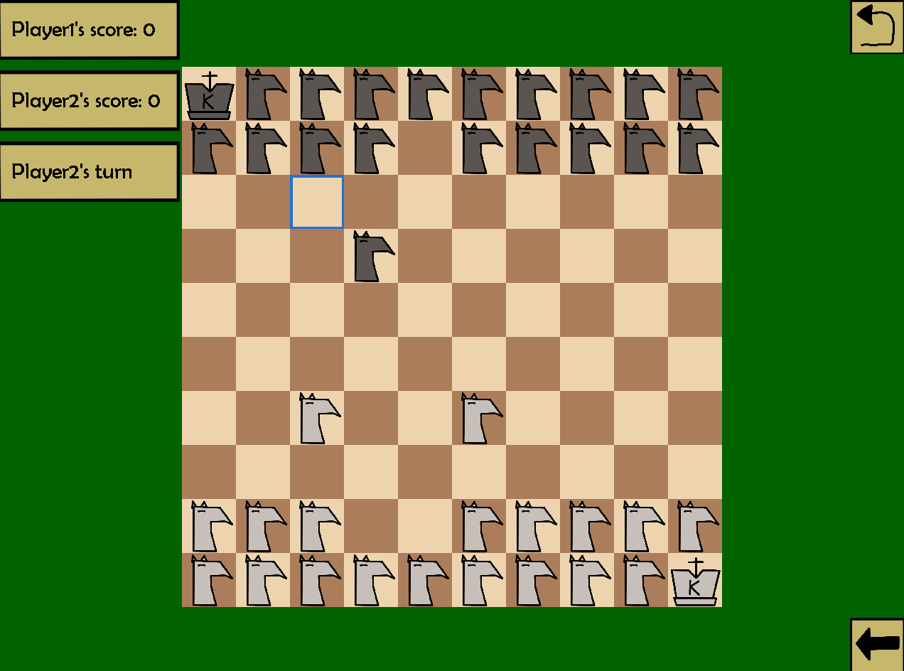

## Blurb

This is an offshoot of a previous uni assignment - a (very crude) chess game but with knights.

(More pieces to be considered?)



## Quick Setup (on Windows-based machine)

Development/testing:

-   Run python main file: `.\run.ps1`
-   Create Python virtual environment: run `.\create_venv.ps1`
-   Activate Python virtual environment: `.\activate_venv.ps1`
-   Build main file/executable: `.\build_main.ps1`
-   Delete build files (including executable): `.\delete_build_files_main.ps1`
-   Perform Python linting: `.\lint.ps1`

## Python Virtual Environment Setup

Using Python `3.12.3`.

-   Create virtual environment:

```
python3.12 -m venv .venv
```

-   Activate virtual environment:

```
.\.venv\Scripts\activate
```

-   Install requirements:

```
pip install -r requirements.txt
```

## Generating executable file (.exe)

References:

-   https://stackoverflow.com/questions/54210392/how-can-i-convert-pygame-to-exe
-   https://pyinstaller.org/en/stable/usage.html

Use `pyinstaller` module to create an executable file of the game project.

Run the build command with the `--noconsole` flag to stop the terminal window from appearing during runtime.

```
pyinstaller --onefile main.py --collect-data data --noconsole
```

`pyinstaller` compiles all project files (including modules, libraries and the Python interpreter) into a single executable.

A `.spec` file will be generated after running this command. Open the file and update the `datas` variable so that it looks like this:

```
datas=[('data/*','data')]
```

Tuples can only be added to the list. The first value of the tuple is the file names to be imported. The second value is the relative path of the files from the main Python file.

Then run the following command:

```
pyinstaller main.spec
```

This will update the asset directory paths into the executable file.
